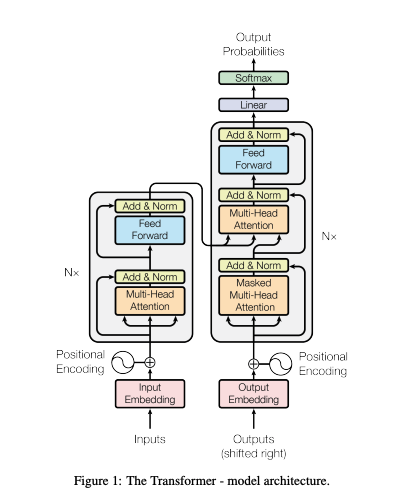

# transformers_scratch
Transformers from scratch for learning and educational purpose

Architecture

[x] Input Block
[x] Positional Encoding Block
[] Multi-Head Attention Block
[] Layer Norm
[] Residual-add & Norm
[] MLP
[] Encoder Block
[] Decoder Block
[] Encoder
[] Decoder
[] Generation
[] build_transformer

Training
[] Dataset
[] Tokenization
[] Training loop

Validation

